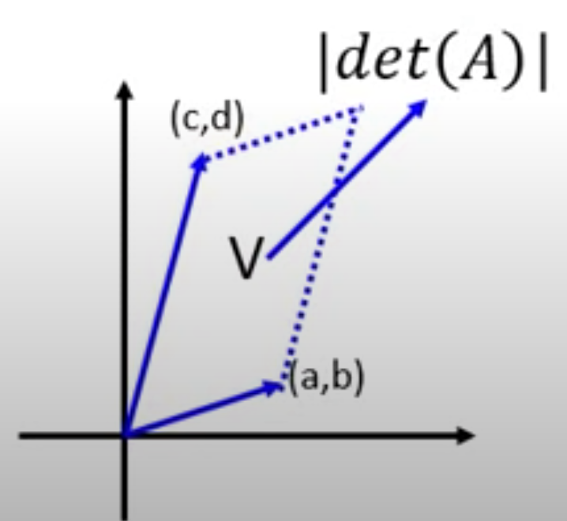

# **Normalizing Flows and Its Friends (Part 1)**

Here is some pre-requisite knowledge required before we move to Normalizing Flows.

**********
# **1. Jacobian Matrix**
Jacobian is a just matrix containing all partial derivatives between each input and output.
It looks scary, but in fact, it is just a fancy name for a partial derivative matrix.

**For example, if**

$$z = \begin{bmatrix} z_{1} \\ z_{2}  \end{bmatrix}$$

$$x = \begin{bmatrix} x_{1} \\ x_{2}  \end{bmatrix}$$

**and**

$$
    z = f(x)
$$

$$
    x = f^{-1}(z)
$$

**then,**

$$ 
    J_{f} = \begin{bmatrix} \frac{\partial x_{1}}{\partial z_{1}} & \frac{\partial x_{1}}{\partial z_{2}}  \\ 
                            \frac{\partial x_{2}}{\partial z_{1}} & \frac{\partial x_{2}}{\partial z_{2}}  \end{bmatrix}
$$

$$ 
    J_{f^{-1}} = \begin{bmatrix} \frac{\partial z_{1}}{\partial x_{1}} & \frac{\partial z_{1}}{\partial x_{2}}  \\ 
                                 \frac{\partial z_{2}}{\partial x_{1}} & \frac{\partial z_{2}}{\partial x_{2}}  \end{bmatrix}
$$

$$
    J_{f} J_{f^{-1}} = I
$$

**********
# **2. Determinant**

Determinant is a scalar value, which describes the area/volume enclosed by all the vectors in a matrix.

**For example, if**

$$
A = \begin{bmatrix} a & b \\ c & d \end{bmatrix}
$$

then, 

$$
    det(A) = ad - bc
$$

The most important thing is that:

$$
    det(A) = {\frac{1}{A^{-1}}}
$$

$$
    det(J_{f}) = {\frac{1}{J_{f^{-1}}}}
$$

In a 2D space, it looks like this:

**********
# **3. Change of Variable Theorem**

$$
    p(x') \mid det {\begin{bmatrix} \Delta x_{11} & \Delta x_{21} \\ 
                            \Delta x_{12} & \Delta x_{22} \end{bmatrix}} \mid = \pi(z') \Delta {z_{1}}  \Delta {z_{2}}
$$

and this becomes to

$$
    p(x') \mid det(J_{f}) \mid = \pi(z')  
$$

$$
    p(x') = \pi(z') \mid {det(J_{f^{-1}})} \mid
$$

## Referemces

1. https://www.youtube.com/watch?v=uXY18nzdSsM&t=169s