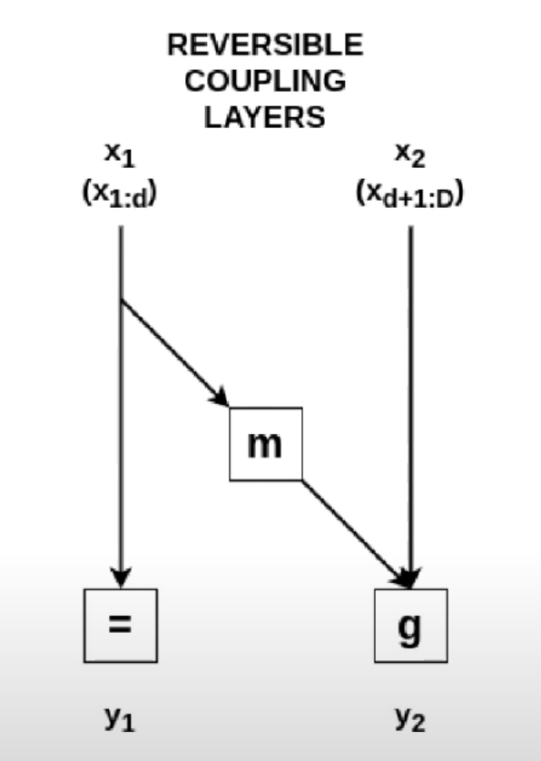
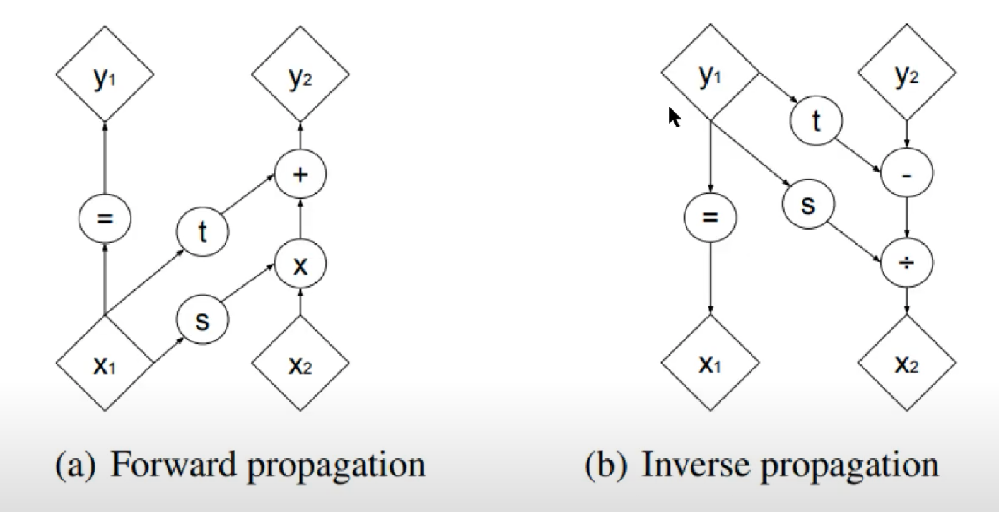

# **Normalizing Flows and Its Friends (Part 2)**

# What is normalizing flows?

One type of generative models is flow-based models, which explicitly learns the mapping between a group of samples $x_{1}$, $x_{2}$, ..., $x_{n}$ to their latent distribution $p(x)$. 

`Normalizing flows` is one example of flow-based models.

# Why normalizing flows?

Given some real world data samples, we are always interested in learning its underlying distributions.
Knowing the exact data distribution $p(x)$ is helpful in some scenarios such as sampling data and identifying bias. 

!!! Objective
    To minimize some notion of distance between $p_{D}$ and $p_{M}$

    * Given a dataset $X=x_{1}, x_{2}, x_{3}, ...$ from an underlying distribution $p_{D}$,
    * Can we find an approximating distribution $p_{M}$, which is from a family of $M$ and parametrized by $\theta$, to minimize the distance between $p_{D}$ and $p_{M}$ ?
    * Mathmatically, it is written as below
    * $$ \theta^{*}=\underset{\theta \in M}{\mathrm{argmin}} \space  dist(p_{\theta}, p_{D}$) $$
    * If KL-divergence is the distance function, the above equation becomes the maximum likelihood estimation ...
    * $$ \theta^{*}=\underset{\theta \in M}{\mathrm{argmin}} \space E_{x~p_{D}} [-log \space p_{\theta}(x)] $$

Flow-based models are different than GAN or VAE, since Flow-based models explicitly learn $p(x)$ by optimizing the log likelihood. 

In GAN, the probability density function estimation is implicit by having the minmax classification error. 
We don't explicitly assign a probability density function and estimate it.

In VAE, we get an approximate probability density function by optimizing the evidence lower bound (which is $p_{\theta}(x|z)$).
The encoder captures the approximate posterior mapping between $x$ and $z$, which is $q$ parameterized by $\phi$. 
The decoder captures $p_{\theta}(x|z)$ which is parameterized by $\theta$.
In this casce, it is an approximate density estimation. 

In short, both GAN and VAE do not explicitly learn probability density function of real data $p(x)$.

In flow-based models, given an $x$, we want to find the function $f$ to get the latent representation $z$. 
And if we invert $f$, we will get $x$ back.
The function $f(x)$ and $f^{-1}_(x)$ are exactly the inverse. And the flow-based models try to capture $f$

# How does it work?

We try to identify a transformation $f: Z \rightarrow X$ where f is a series of **differentiable** and **invertible** functions ($f_{1}$, $f_{2}$, ..., $f_{K}$,)

In general, for any invertible function $f: Z \rightarrow X$, the probability function is below. The detailed steps can be found in [this page](./nf1.md)

$$
    p(x') = \pi(z') \mid {det(J_{f^{-1}})} \mid
$$

$$
    log \space p(x') = log \space \pi(z') + \sum^{K}_{i=1} log \mid {det(J_{f^{-1}})} \mid
$$

Intuition:

* The first term describes the transformation $f$ moulds the density $p_{Z}(z)$ into $p_{X}(x)$.
* The second term describes the relative change of volume around $z$

In summary, the three requirements must hold for a normalizing flow model: 

* Transformation function $f$ should be differentiable
* Transformation function $f$ should be invertible
* Determinant of Jacobian should be easy to compute

## Example 1: NICE (Non-linear Independent Components Estimation)

Coupling layer operation:
$$
    y_{1} = x_{1}
$$

$$
    y_{2} = g(x_{2};m(x_{1}))
$$

Therefore, its Jacobian is a lower-triangular matrix and the determinant is the product of diagonal elements
    
$$
    \frac{\partial y}{\partial x} = \begin{bmatrix} I & 0  \\ \frac{\partial y_{2}}{\partial x_{1}} & \frac{\partial y_{2}}{\partial x_{2}}  \end{bmatrix}
$$

The inverse mappings are:

$$
    x_{1} = y_{1}
$$

$$
    x_{2} = g^{-1}(y_{2}, m(y_{1}))
$$

## Example 2: Real NVP (Real-valued Non Volume Preserving)

Affine coupling operations are (there is one translation component and one scale component for $y_{2}$):

$$
    y_{1} = x_{1}
$$

$$
    y_{2} = x_{2} \odot exp(s(x_{1})) + t(x_{1})
$$

The Jacobian becomes

$$
    \frac{\partial y}{\partial x} = \begin{bmatrix} I_{d} & 0  \\ \frac{\partial y_{2}}{\partial x_{1}} & diag(exp[s(x_{1})])  \end{bmatrix}
$$

Since the Jacobian matrix is not always equal to 1, affine coupling is not always volume preserving which is more realistic in real world data.

The inverse operations are:

$$
    x_{1} = y_{1}
$$

$$
    x_{2} = (y_{2} - t(y_{1})) \odot exp(-s(y_{1})) 
$$

## References
1. https://www.youtube.com/watch?v=RPkf516rXgw
2. https://www.youtube.com/watch?v=PCfHd0Ec6M4
3. https://stackoverflow.com/questions/54635355/what-does-log-prob-do