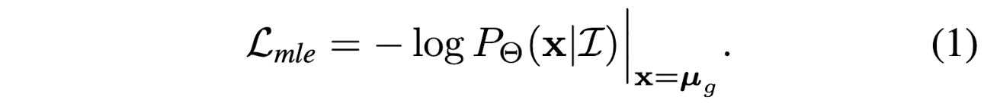
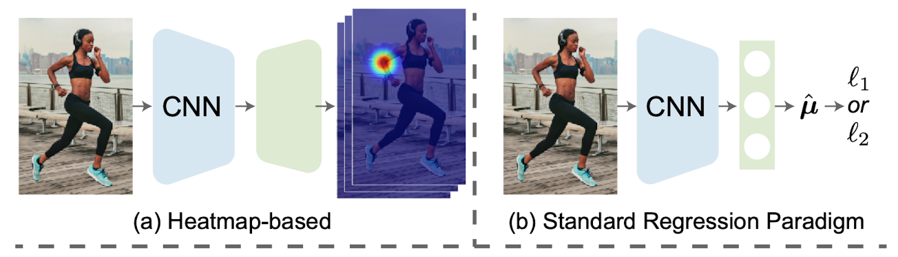
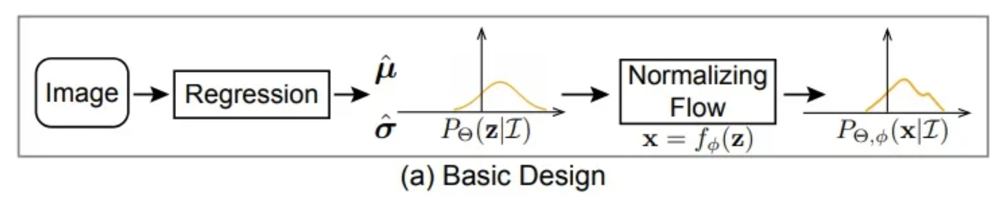
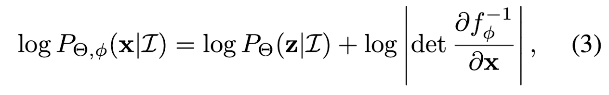
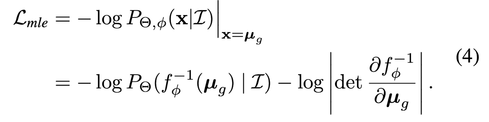
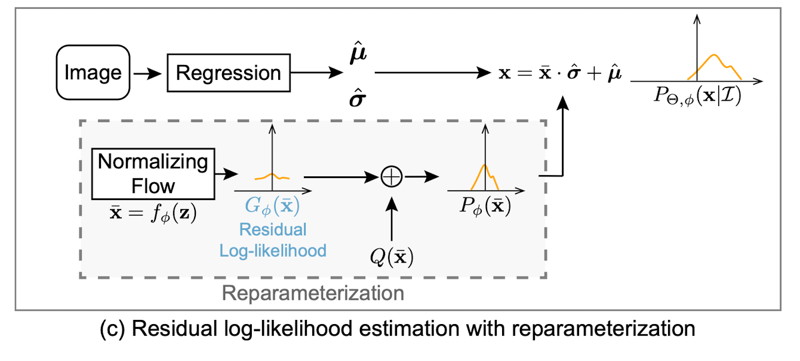
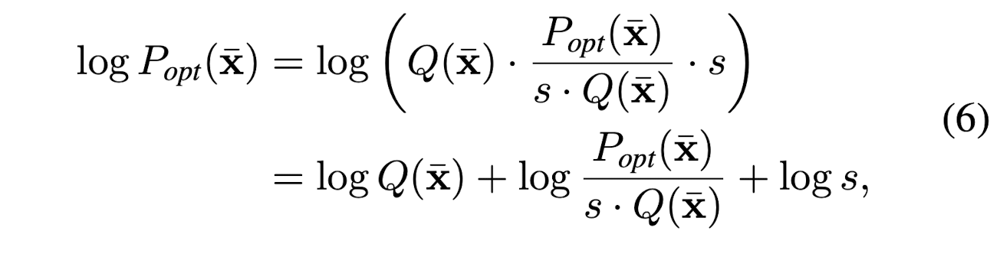

# Paper Reading: Human Pose Regression with Residual Log-likelihood Estimation (ICCV 2021 Oral)

## **Summary**

Regression problem can be reviewed from the maximum likelihood estimation perspective.
The learning process of a model is to optimize its learnable parameters $\phi$ that makes labels $\mu_{g}$ most probable.

* If we assume the ground truth follows a laplacian distrbution, then the loss funciton is $L1$.
* If we assume the ground truth follows a gaussian distribution, then the loss function is $L2$.

From this perspective, the loss function depends on the shape of distribution $P_{\phi}(x | I)$

However, in reality, the number of samples are infinite and the real underlying distribution are unknown. 
It is hard to compute the real distribution of the data.

In this paper, the authors take all deviations (i.e. the differences between predictions and ground truth) as samples, 
feed them to a flow-based model, 
so that the model is able to learn a mapping between simple distribution and a real distribution of the deviations. 
Three different designs are proposed to achieve this.
Finally, a new loss function is formed, which is parameterized by the distribution of deviations. 

## **Heatmap-based or Regression-based Human Pose Estimation?**

In heatmap-based approach, the ground truth, which is usually represented by $K$ number of discrete 2D points, is firstly converted into $K$ number of continous guassian heatmap. 
The heatmaps have dimension of $[K, H, W]$ where $H$ and $W$ stand for height and width, respectively. 
During model training, ML models predict $K$ number of feature maps, and element-wisely compare the results with the gaussian heatmaps.
In this type of approach, the dimension of the gaussian heatmap directly affects the prediction accuracy, and it is also expensive to compute and save the heatmaps.Hence, the heatmap is a bottleneck. 

In regression-based approach, all of the human joints (`(K joints, 3)`) are directly predicted by a model. 
With $L1$ or $L2$ losses, the loss value are directly compuated by comparing predicted coordinates and the ground truth. 
Since there are no needs for heatmaps in this regression-based approach, it is more widely used in practicse.

In general, heatmap-based approach is able to deliver a better prediction than the regression-based approach. 
This is largely because a heatmap-based model only needs to predict a group of *continous* feature map, who should be as close as the ground truth gaussian maps. 
In other words, the objective of the model is to learn how to convert a given 2D image into a group of specific gaussian maps by filtering this image.
The convolutional layers are really good at doing this type of filtering procedure. 
Mathmatically, it also means that the distribution of the ground truth are solidly defined (which is a guassian distribution). 
We just need to design the ML models and loss functions in a way such that the final predictions get to this distirbution as closely as possible. 

In a quick summary, the table below lists the advantages and disadvantages of both approaches

| Method Name              | Heatmap-based Approach      | Regression-based Approach |
| ------------------------ | --------------------------- | ------------------------- |
| Output space             | Discrete                    | Continuous                |  
| Computational Overhead   | High                        | Low                       |
| Prediction Accuracy      | High                        | Low                       |
| Expandability            | Low                         | High                      | 

## **Normalizing flows**
An introduction on normalization flows can be found here.

### 1.Basic Design

Basically, a flow model is able to convert a simple distribution into a complex distribution. 
The theory behind it proves that any distributions can be modeled as long as the flow model is sufficiently complex. 

Because of this theory, the regression model can firstly predict a simple distribtuion.
An example would be the gaussian distribution, which is defined by $\hat{\mu}$ and $\hat{\sigma}$.
Next, the normalizing flows model transforms this simple distribution to the real distribution through a smooth and invertible mapping $f_{\phi}$

In other words, the probability density function $P_{\theta, \phi} (x | I)$ depends on both the regression model $\theta$ and the flow model $f_{\phi}$.

Mathmatically, it is written as:

Hence, the maximum likelihood estimation is:

### 2.Reparameterization

The `design a` is not feasible in practise, because the $f_{\phi}$ will learn to fit the distribution of $\mu_{g}$ across all images.
However, the distribution that we are interested in is *how the output deviates from the ground truth conditioning on the input image*, 
not distribution of the ground truth across all input images. 

Assuming all the underlying distributions share the same density function family but with different mean and variance conditioning on the input $I$.

The flow model firstly maps a zero-mean initial distribution $N(0, I)$ to a zero-mean deformed distribution $P_{\phi}(x)$.
Then, the regression model predicts a translation parameter $\hat{\mu}$ and scale parameter $\hat{\sigma}$ to control the position of the deformed distribution.
In other words, $\hat{\mu}$ and $\hat{\sigma}$, together, describe the the amount of deviation between predictions and ground truth.
The final distribution $P_{\theta, \phi} (x | I)$ is obtained from $x = \bar{x} * \hat{\sigma} + \hat{\mu}$

Hence, the maximum likelihood estimation is:

where

* $\bar{\mu}_{g} = (\mu_{g} - \hat{\mu}) / \hat{\sigma}$
* $\partial \bar{\mu}_{g} / \partial \mu_{g} = 1 / \hat{\sigma} $
* $\mu_{g}$ is ground truth from annotation
* $\hat{\mu}$ and $\hat{\sigma}$, are the amount of deviation between predictions and ground truth
* $\bar{\mu}_{g}$ is the ground truth used in the objective function. It is a result, computed by subtracting each ground truth from deviation. The flow model takes these samples, and tries to learn this distribution.   

### 3.Residual log-likelihood estimation

The training of $\hat{\mu}$ and $\hat{\sigma}$ is closely tied with the training of flow model.
At the beginning of the training, the distribution shape is far from correct, which increases the difficulty to train the regresson model.

A gradient shortcut was developed to reduce the dependencies between the flow model and regression model. 
$P_{\phi}(\bar{x})$ is trying to fit the optimal underlying distribution $P_{opt}(\bar{x})$

where

* $Q(\bar{x})$ can be a simple distribution, i.e. Gaussian or Laplacian distribution
* $log \frac{P_{opt}(\bar{x})}{s*Q(\bar{x})}$ is called residual log-likelihood
* $log s$, is constant, which makes the whole equation stay as a distribution

The assumption is that the simple distribution $Q(\bar{x})$ is a rough estimation of the underlying distribution.
And the *residual log-likelihood* is to finetune or compensite for the difference.

where

* $G_{\phi}(\bar{x})$ is the distribution learned by the flow model.
  
In this way, $G_{\phi}(\bar{x})$ will try to fintune the overal distribution $Q(\bar{x})$, instead of directly fitting the underlying distribution. 

Hence, the maximum likelihood estimation is:

By doing this, The backward propagation of $Q(\bar{x})$ does not depend on the flow model.
It is also easier to train the residual mapping than train the original unreferenced mapping. 

## Implementations

The initial density is set to be a zero-mean $N(0, I)$
During inference, the regression model predict $\hat{\mu}$, which can directly be used as regressed outputs. 
No need for the flow model.

## Some Technical Details
* The value of Residual log-likelihood can be positive or negative number, because of $L=-log p$. The term becomes negative when $p$ is larger than 1
* In `bar_mu = (src_poses - gt_uvd) / sigma`, coordinate normalization is performed. A `sigmoid` operation is also performed on `sigma`. 

REF:

1. https://zhuanlan.zhihu.com/p/395521994
2. https://zhuanlan.zhihu.com/p/429017412