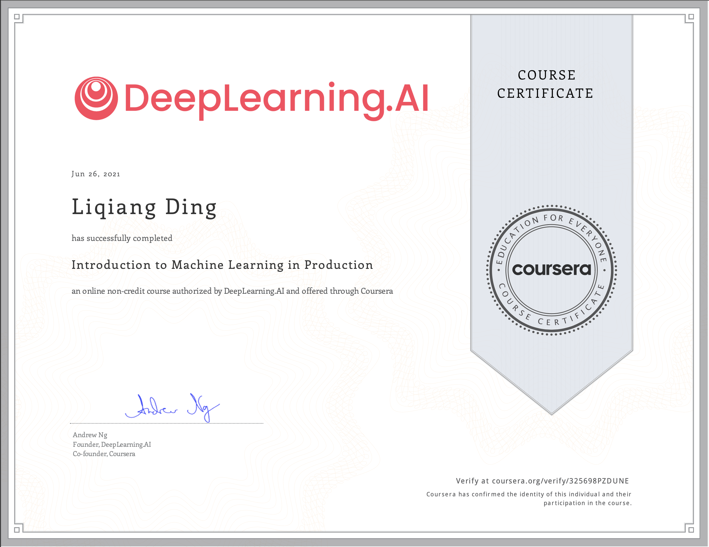
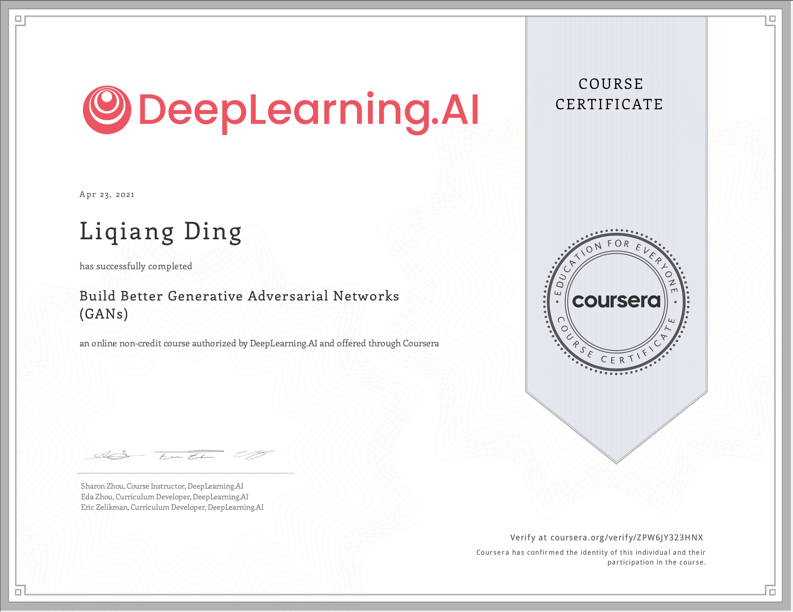
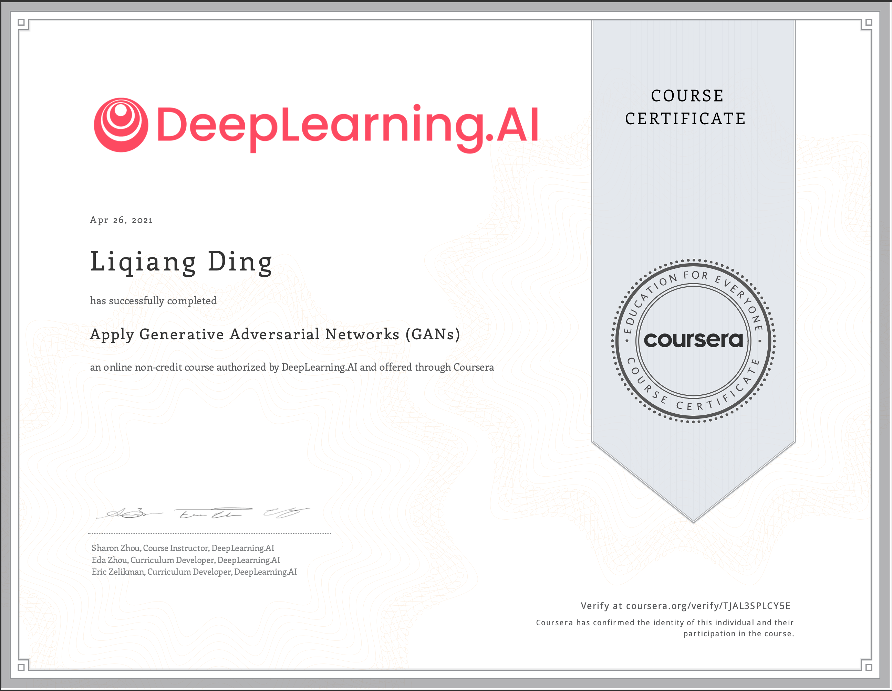
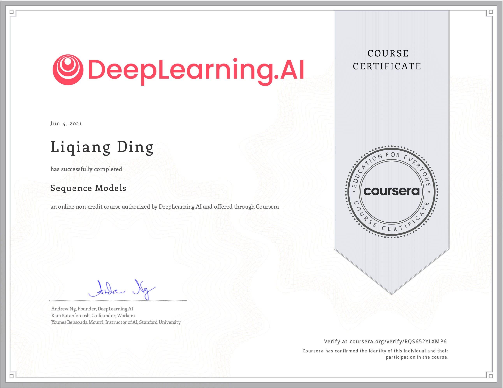
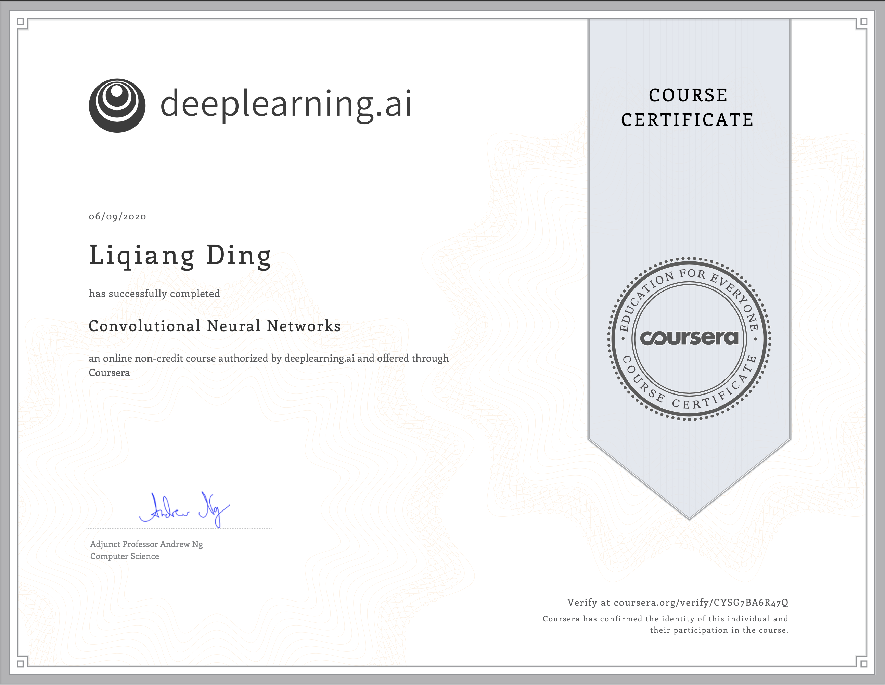
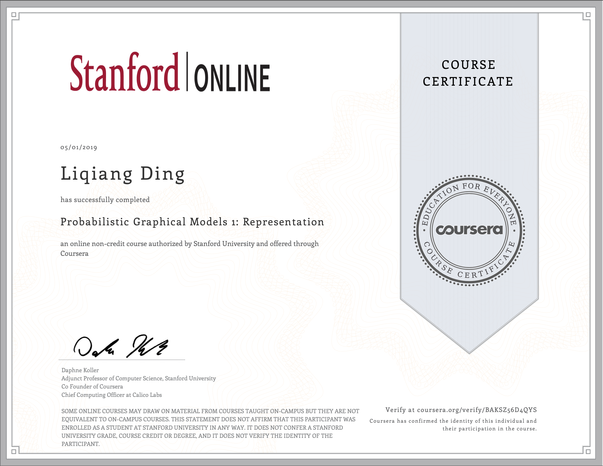

# Learning is a life-long process ... 

**ML Operations**                      |
:-------------------------------------:|
|  

Generative Adversariel Networks Certificate | Generative Adversariel Networks Course 1
:------------------------------------------:|:----------------------------------------:
| 

Generative Adversariel Networks Course 2 | Generative Adversariel Networks Course 3          
:---------------------------------------:|:------------------------------------------:
       | 

 Sequence Models                       |  Convolutional Neural Networks       |
:-------------------------------------:|:-------------------------------------:
     | 

Probabilistic Graphics Model           |
:-------------------------------------:|
|  
