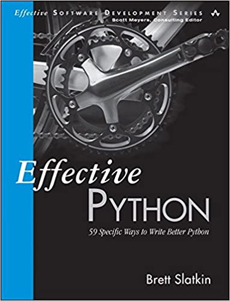

# PythonWoW

As a machine learning developer/researcher, I encountered many python related questions from time to time. The majority of them are straightforward, but some are subtle to understand, and hard to be applied properly in real practise. During the process for searching answers, I realized that it usually becomes super clear if I write them down with my own examples and understanding.

This repository serves as my notes to track of these questions. I usually start from the problem statement raised from a real world example, and goes to the reasons behind it.
I would be also very happy if this can help you.

[Click me for details](https://github.com/Lionelding/PythonWOW)

**********
# Tensorflow2 Practises

Finally, tensorflow got upgraded to 2.x. It is time to try it out and have some fun :)

[Click me for details](https://github.com/Lionelding/tensorflow2_practise)

**********

# Code practise with `Efficient Python`

This repository contains notes that I took while reading this book.

In general, this is a very fruitful journey. 
The author covers eight major areas about python programming, 
which are super interesting and especially helpful for my daily work as a machine learning engineer. 
For these intermediate/senior level technical books, 
I find that the best way to absorb them is to code as I read them through. 
Therefore, all the codes in this repo are the examples that the author mentions in his book. 
Also, since a number of chapters require some additional background knowledge, 
I also write them down together with my own interpretation in separate files, which live in the relevant folders.

Anyway, I will be very glad if you find these examples are helpful for your projects, or you just have some fun reading them. Please feel free to send me an email if you find a mistake or you don't agree with my interpretations.

[Click me for details](https://github.com/Lionelding/EfficientPython)

**********
# Frequency
<iframe width="720" height="480" src="https://www.youtube.com/embed/An_lbQUgL_c" title="YouTube video player" frameborder="0" allow="accelerometer; autoplay; clipboard-write; encrypted-media; gyroscope; picture-in-picture" allowfullscreen></iframe>

A video receiver with analog circuits. Wait till the end for an easter egg (if you are big a fun of the movie `Inception`)

**********
# When Beethoven Meets VHDL
<iframe width="720" height="480" src="https://www.youtube.com/embed/4oVpbwW00Ok" title="YouTube video player" frameborder="0" allow="accelerometer; autoplay; clipboard-write; encrypted-media; gyroscope; picture-in-picture" allowfullscreen></iframe>

A music box with digital circuits.

**********
# McGill Gear Solid
<iframe width="720" height="480" src="https://www.youtube.com/embed/xH0ywySv5kc" title="YouTube video player" frameborder="0" allow="accelerometer; autoplay; clipboard-write; encrypted-media; gyroscope; picture-in-picture" allowfullscreen></iframe>

Led a team of 6 from different engineering faculties to design a robot in 7 weeks. 
The robot is able to localize, navigate, avoid obstacles and rescue blocks on 365*365 cm maps by using a single processor and sensors

**********

**********
