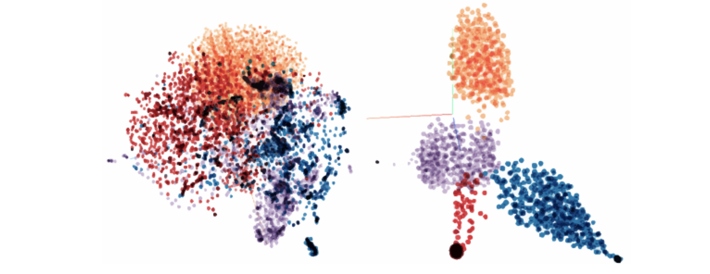

# My Research Interests

[Google scholar](https://scholar.google.ca/citations?user=P87La54AAAAJ&hl=en)

**********
### **Task Adaptive Metric Space for Medium-Shot Medical Image Classification**

* 22th International Conference on Medical Image Computing and Computer Assisted Intervention (MICCAI), 2019
* [Full paper](https://link.springer.com/chapter/10.1007/978-3-030-32239-7_17)
* [poster](https://drive.google.com/file/d/1r2X77euy1spJDXuVIKr-rUivVH72Pq7K/view?usp=sharing)

**********
### **Artificial Intelligence for Real-Time Multiple Polyp Detection with Identification, Tracking, and Optical Biopsy During Colonoscopy**

* Journal of Gastroenterology, 2019
* [Full paper](https://www.researchgate.net/publication/332884708_256_-_Artificial_Intelligence_for_Real-Time_Multiple_Polyp_Detection_with_Identification_Tracking_and_Optical_Biopsy_During_Colonoscopy)

**********
### **A Single Framework for Domain Adaptation and Generalization in Medical Image Analysis**

* Montreal AI Symposium (MAIS), 2018
* [Full paper](https://montrealaisymposium.wordpress.com/)
* [poster](https://drive.google.com/file/d/1qWOu52SfOSqm_zHZ2xg-f_Jlsx-6Z2CA/view?usp=sharing)

**********
### **Apparatus and method for detecting, classifying and tracking road users on frames of video data**
* US Patent, Application US16/535,547 events
* [Full description](https://patents.google.com/patent/US20200050870A1/en)

**********
### **Deep-learning-based multiple object tracking in traffic surveillance video**

<iframe width="720" height="480" src="https://www.youtube.com/embed/jqO_s2WKYjQ" title="YouTube video player" frameborder="0" allow="accelerometer; autoplay; clipboard-write; encrypted-media; gyroscope; picture-in-picture" allowfullscreen></iframe>

* Master Thesis, McGill University, 2018
* [Full paper](https://escholarship.mcgill.ca/concern/theses/sj139437f)

**********
### **Generation of spatial-temporal panoramas with a single moving camera**

* 13th Conference on Computer and Robot Vision (CRV), 2016
* [Full paper](https://ieeexplore.ieee.org/document/7801534)
* [Video](https://www.youtube.com/watch?v=tUYozU_NIIk)
